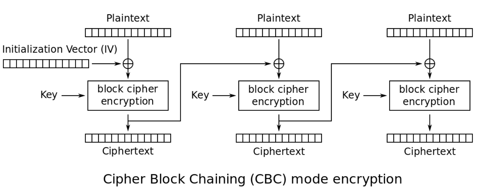

### More Cookies 
I forgot Cookies can Be modified Client-side, so now I decided to encrypt them! http://mercury.picoctf.net:15614/

這題的Cookie 使用Cipher block chaining (CBC)加密

輸入 document.cookie 可以得到auth_name 
但如果直接base64decode 只會得到亂碼(因為被加密)

可以使用暴力攻擊來猜測CBC的IV為何，並求出flag

自評難度：Medium

